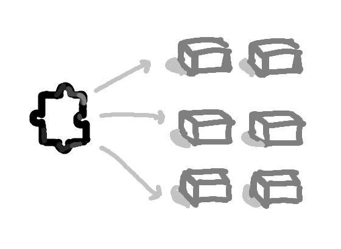

<div>
  <p align="center">
    
  </p>
  <h1 align="center">Compo</h1>
  <p align="center">
    <a href="LICENSE.md">
      
    </a>
  </p>
  <p align="center">
    Compo is a lightweight, Unity-like <b>component framework</b> for Roblox 📦. 
  </p>
</div>

> [!CAUTION]
> Compo is currently in development and not yet ready for production use. Please **DO NOT** use it in production, as breaking changes may occur at any time.

## Installation 📦
You can install Compo via Wally or by downloading the [.rbxm]("https://github.com/sparkiyy/Compo/releases") file:

```toml
compo = "sparkiyy/compo@VERSION"
```

And you can get Compo Inspector via [Roblox Marketplace](https://create.roblox.com/store/asset/94811734793830/Compo-Inspector) or [Releases page ](https://github.com/sparkiyy/Compo/releases)

---

## Introduction 👾
In many Roblox games, you'll often find dozens of nearly identical scripts scattered across different instances. For example, many _kill parts_ might each have their own `Touched` script.

While that might be manageable in a small game, it quickly becomes a **nightmare** as your project grows. Want to tweak the behavior? You’ll need to update each script manually — which leads to duplication, inconsistencies, and a messy workflow.


That’s where **Compo** comes in. 

It introduces a component-based approach, heavily inspired by Unity's `MonoBehaviour` system. Instead of attaching full scripts to every object, you write clean, reusable components and assign them to multiple instances — modular, scalable, and way easier to maintain.


### 👻 Inspector

At the core of the system is Compo Inspector — a required plugin that connects your components to the runtime environment.

It automatically detects all modules ending with the `.component` suffix and lets you assign them to instances through the inspector window. You can also expose `fields` in your components to customize behavior per instance 

 

These `fields` are stored as attributes on the instance, using a special naming convention that Compo recognizes at runtime. While it's technically possible to set them manually like this...

```lua
instance:SetAttribute("_component_field" .. COMPONENT_ID .. FIELD_NAME, value)
```
...doing so defeats the purpose of using Compo. You’d be skipping validation, editor integration, and the ease-of-use that Compo Inspector provides. It takes care of all the tedious setup so your components are consistent, safe, and ready to go.

---
## Getting Started 🐼
Components are created using the `.component` suffix. This tells the plugin to register the component and show it in the inspector.

Currently, components can **only** be descendants of the following two realms:

* StarterPlayerScripts
* ServerScriptService

```lua
-- myAwesomeComponent.component.luau
local Compo = require(game.ReplicatedStorage.compo)

return Compo.createComponent(function(component)
    function component.start()
        print("Hello world c:, from: " .. component.instance.Name)   
    end

    function component.onDestroy()
        print("Goodbye world :c, from: " .. component.instance.Name) 
    end
end)
```

> [!IMPORTANT] 
> Each registered component gets a unique internal ID. Compo Inspector attaches this ID to the module so the runtime can track and manage it reliably.🔒 **Don't modify or remove** this ID manually, or things might break.

### 💡 Productivity Tip
Compo Inspector provides autocomplete support. Just type `:Component` inside a module, and — voilà! — you’ll instantly get a working component template to start with:


### 🚀 Launching
To start Compo, you need to initialize it separately in each realm (client/server):

```lua
-- client
local compo = require(game.ReplicatedStorage.compo)

-- launch() returns a promise that resolves when the main loop starts
compo.launch():andThen(function()
    print("Compo started!")
end)
```
Once launched, Compo will detect and activate all assigned components for that realm.

## Serialized Fields 🦭
One of the most powerful features of Compo is the ability to define custom, editable fields in your components — just like Unity's serialized fields. These fields allow you to customize component behavior per instance.

### 💣 Defining Fields
To expose fields, pass a second argument to createComponent: a table describing the fields and their default values.

```lua
return Compo.createComponent(function(component)
  -- ...
, {
	number = Compo.fields.number(),
	string = Compo.fields.string(),
	boolean = Compo.fields.boolean(),
	vector3 = Compo.fields.vector3(),
	vector2 = Compo.fields.vector2()
})
```
When a field is exposed:
* It's stored as an attribute on the instance.
* The field's value can be accessed at runtime through `component.fields`.

### ✅ Supported Types

| Type    | API                     | Default Value  |
| ------- | ------------------------| -------------- |
| String  | `Compo.fields.string()` | `""`           |
| Number  | `Compo.fields.number()` | `0`            |
| Boolean | `Compo.fields.boolean()`| `true`         |
| Vector3 | `Compo.fields.vector3()`| `Vector3.zero` |
| Vector2 | `Compo.fields.vector2()`| `Vector2.zero` |

You can customize the default value by passing it in. If no value is passed, the default one is used.

> All data is safely stored as attributes with a special naming format that Compo parses at runtime.
---
## Life Cycle

<p align="center"> </p>
The Compo runtime follows a structured lifecycle for every component, giving you hooks to run logic at different phases:


| Phase           | Description                                                                                                                                                              |
| --------------- | ------------------------------------------------------------------------------------------------------------------------------------------------------------------------ |
| `awake()`       | Called as soon as the scheduler detects and loads the component. Can yield.                                                                                              |
| `onEnable()`    | Called after `awake()`. Runs once when the component is first enabled, and again if re-enabled later. Can yield.                                                         |
| `start()`       | Called **only after all components in the realm have completed their `awake()` and `onEnable()`**. This guarantees that everything is initialized before `start()` runs. |
| `update()`      | Called every frame on `RunService.Heartbeat`.                                                                                                                            |
| `fixedUpdate()` | Called at a fixed interval (default: 0.02s), independent of frame rate.                                                                                                  |
| `onDisable()`   | Called when the component is disabled or the instance is removed.                                                                                                        |
| `onDestroy()`   | Called when the component is permanently unregistered or destroyed.                                                                                                      |
> [!NOTE]
> When a component yields in awake() or onEnable(), it delays the entire lifecycle — meaning no component will run start() until all components have completed both phases.
---
> Compo was made with ❤️ by sparkiyy, happy coding! ^.^