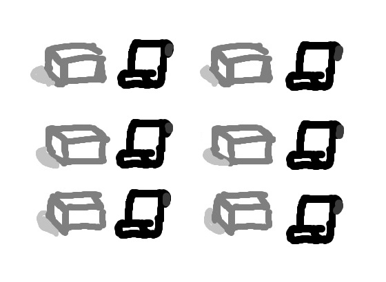
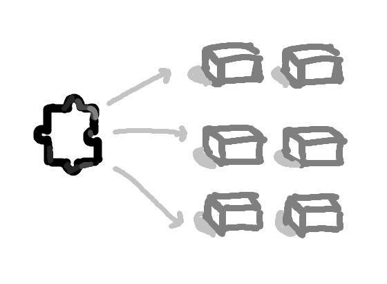
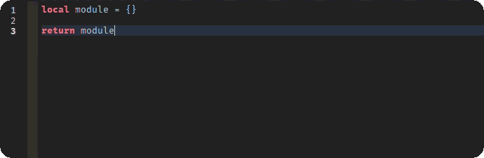
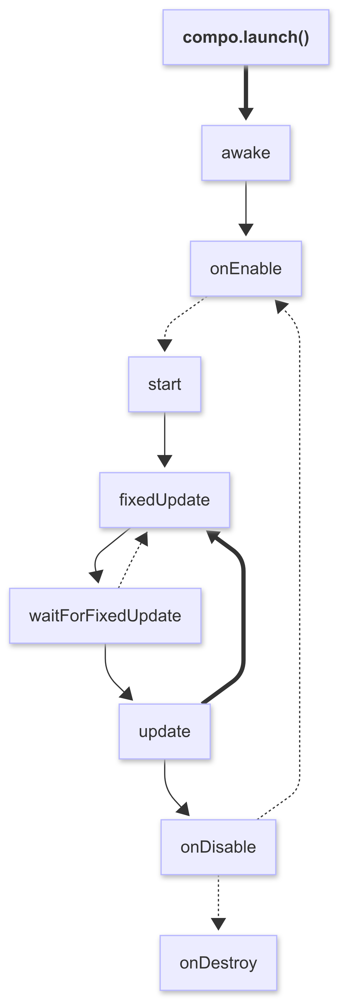
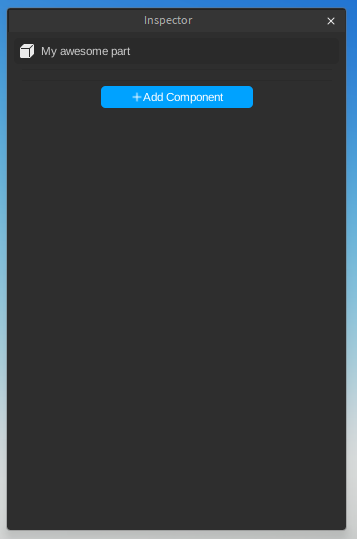
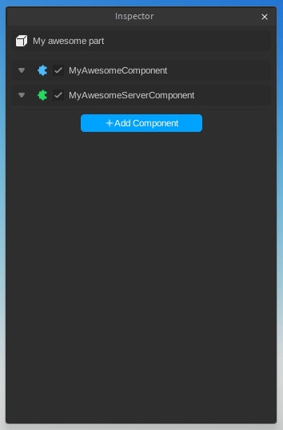

<div>
  <p align="center">
    
    <p align="center">[PREVIEW]</p>
  </p>
  <h1 align="center">Compo</h1>
  <p align="center">
     
    <a href="LICENSE.md">
      
    </a>
  </p>
  <p align="center">
    Compo is a lightweight, Unity-like <b>component framework</b> for Roblox 📦.
  </p>
</div>

## Installation 🔔
You can install Compo via Wally or by downloading the [.rbxm]("https://github.com/sparkiyy/Compo/releases") file:

```toml
compo = "sparkiyy/compo@VERSION"
```

And you can get Compo Inspector via [Roblox Marketplace](https://create.roblox.com/store/asset/) or [Releases page ](https://github.com/sparkiyy/Compo/releases)

## Introduction 🔥
In a lot of Roblox games, you'll often find dozens of nearly identical scripts scattered across different objects. For example, many _kill parts_ might each have their own `Touched` script.
While that might work fine when your game is small, it quickly becomes a headache as your project grows. Want to make a change to how things work? You’d have to update each script individually, which can lead to errors, duplication of effort, and messy management. 



That’s where Compo comes in. 
It introduces a component-based approach, heavily inspired by Unity's MonoBehaviour system. Instead of attaching a full script to every object, you create a reusable component and assign it to multiple instances.


### Inspector 🐙

At the core of the whole system is Compo Inspector — a must-have plugin that connects your component setups with the runtime environment. Think of it as the middleman that scans your project for modules with the .component suffix and makes it super easy to assign them to specific instances through a user-friendly editor, similar to Unity’s Inspector. You can also expose editable fields within your components, letting you customize things on a per-instance basis like numbers, strings, booleans, enums, Vector3, Color3, and more. These fields get stored as attributes on each instance using a special naming pattern that Compo recognizes when the game runs. You can technically set these attributes manually using something like this:
```luau
instance:SetAttribute("_component_field" .. COMPONENT_ID .. FIELD_NAME, value)
```
But that kinda defeats the point of using Compo. Doing it yourself skips the safety checks, convenience, and the handy editor features that Compo Inspector offers. It handles all that tedious stuff for you, making sure your components are set up right and stay consistent.

## Guide 🐆
Compo is an 
Maybe you're wondering right now, why? if you can simply use collection service to do the 70% _(exagerating)_ of compo features? 

Components are created using the `.component` suffix. This tells the plugin to register the component and show it in the inspector.

Currently, components can **only** be descendants of the following two realms:

* StarterPlayerScripts
* ServerScriptService

```lua
-- myAwesomeComponent.component.luau
local compo = require(game.ReplicatedStorage.compo)

return compo.createComponent(function(component)
    function component.start()
        print("Hello world c:, from: " .. component.instance.Name)   
    end

    function component.onDestroy()
        print("Goodbye world :c, from: " .. component.instance.Name) 
    end
end)
```
Compo Inspector offers a autocomplete, just type ```:Component``` and — voilà! —, you now have a functional template to start working on!


The Compo Inspector will automatically attach a unique ID to the module. Compo uses this ID to track the component at runtime, so **don’t remove or modify it**.

To initialize Compo, you need to start it in each realm:

```lua
-- client.lua
local compo = require(game.ReplicatedStorage.compo)

-- launch() returns a promise that resolves when the main loop starts
compo.launch():andThen(function()
    print("Compo started!")
end)
```
> \[!NOTE]
> Compo was designed to be used together with the **Compo Inspector** plugin.
> You can technically use it without the plugin, but you’ll have to assign every value manually — **not recommended**.

## Life Cycle

<p align="center"> </p>

| Stage         | Description                                                                                           |
|---------------|-----------------------------------------------------------------------------------------------------|
| `awake()`     | Called immediately after the scheduler runs (can yield).                                           |
| `onEnable()`  | Called the first time after each component finishes the awake phase and whenever the component is re-enabled (can yield, only the first time). |
| `start()`     | Called on the first frame after all registered components have finished awake and onEnable phases.  |
| `update()`    | Called every frame during `RunService.Heartbeat`.                                                   |
| `fixedUpdate()`| Called at a fixed time interval (0.02s by default), independent of the frame rate.                  |
| `onDisable()` | Called when a component is deactivated.                                                             |
| `onDestroy()` | Called when a component is permanently unregistered (destroyed).                                    |


## Inspector 🐙

As mentioned before, the real power of Compo comes with its inspector, which is an extension of the Roblox Properties panel:

<p align="center">
   
   
</p>
