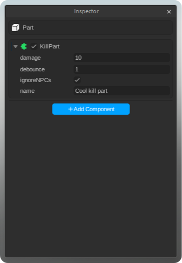

<div>
  <p align="center">
    
    <p align="center">[PREVIEW]</p>
  </p>
  <h1 align="center">Compo</h1>
  <p align="center">
     
    <a href="UNLICENSE.md">
      
    </a>
  </p>
  <p align="center">
    Compo is a lightweight, Unity-like <b>component framework</b> for Roblox 📦.
  </p>
</div>

## Installation 🦭

You can install Compo via Wally or by downloading the `.rbxm` file:

```toml
[dependencies]
compo = "sparkiyy/compo@VERSION"
````

## Guide 🐆

🚧 This guide assumes you have already installed the Compo Inspector.

Components are created using the `.component` suffix. This tells the plugin to register the component and show it in the inspector.

Currently, components can **only** be descendants of the following two realms:

* StarterPlayerScripts
* ServerScriptService

```lua
-- myAwesomeComponent.component.luau
local compo = require(game.ReplicatedStorage.compo)

return compo.createComponent(function(component)
    function component.start()
        print("Hello world c:, from: " .. component.instance.Name)   
    end

    function component.onDestroy()
        print("Goodbye world :c, from: " .. component.instance.Name) 
    end
end)
```

The Compo Inspector will automatically attach a unique ID to the module. Compo uses this ID to track the component at runtime, so **don’t remove or modify it**.

To initialize Compo, you need to start it in each realm:

```lua
-- client.lua
local compo = require(game.ReplicatedStorage.compo)

-- start() returns a promise that resolves when the main loop starts
compo.start():andThen(function()
    print("Compo started!")
end)
```
> \[!NOTE]
> Compo was designed to be used together with the **Compo Inspector** plugin.
> You can technically use it without the plugin, but you’ll have to assign every value manually — **not recommended**.

## Life Cycle

<p align="center"> </p>

| Stage         | Description                                                                                           |
|---------------|-----------------------------------------------------------------------------------------------------|
| `awake()`     | Called immediately after the scheduler runs (can yield).                                           |
| `onEnable()`  | Called the first time after each component finishes the awake phase and whenever the component is re-enabled (can yield, only the first time). |
| `start()`     | Called on the first frame after all registered components have finished awake and onEnable phases.  |
| `update()`    | Called every frame during `RunService.Heartbeat`.                                                   |
| `fixedUpdate()`| Called at a fixed time interval (0.02s by default), independent of the frame rate.                  |
| `onDisable()` | Called when a component is deactivated.                                                             |
| `onDestroy()` | Called when a component is permanently unregistered (destroyed).                                    |


## Inspector 🐙

As mentioned before, the real power of Compo comes with its inspector, which is an extension of the Roblox Properties panel:

<p align="center">
   
   
</p>
